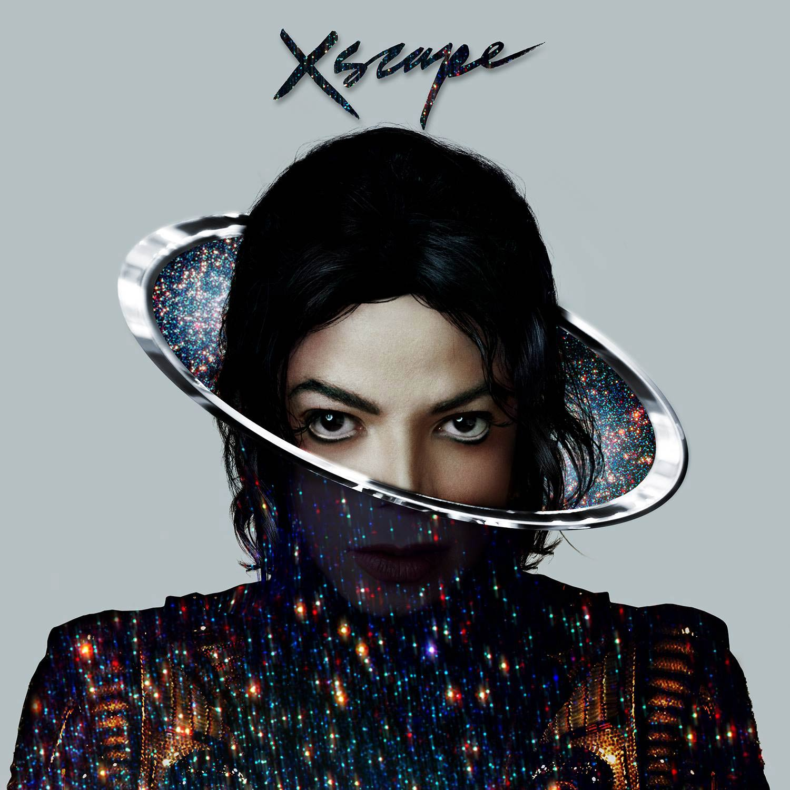
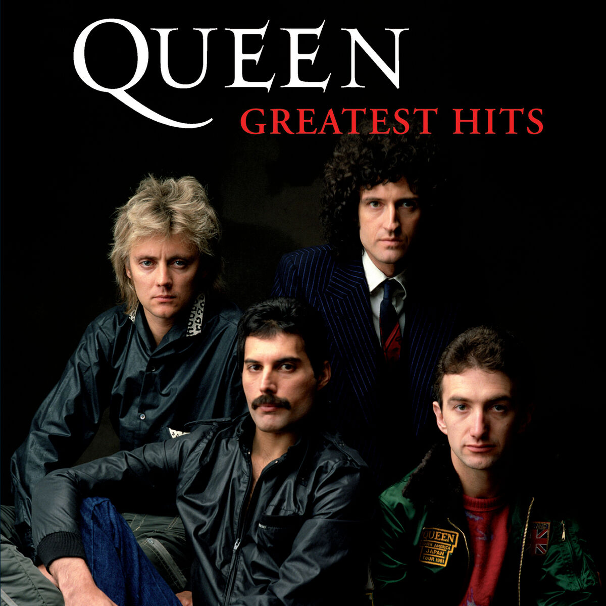

# Sesión 5: HTML y CSS + JavaScript

## Fecha: 28/03/2025

---

## Objetivos de la Sesión

¿Qué es HTML? Explicación de los fundamentos del Lenguaje de marcado de hipertexto

El lenguaje de marcado de hipertexto, Hypertext Markup Language o HTML es un lenguaje de programación que forma parte de la mayoría de las páginas web y aplicaciones en línea.

Un hipertexto es un texto que se utiliza para enlazar con otros textos, mientras que un lenguaje de marcado es una serie de marcas que indican a los servidores web la estructura y el estilo de un documento.

## Todas las páginas HTML utilizan estas tres etiquetas:

La etiqueta `<html>` es el elemento raíz que define todo el documento HTML.
La etiqueta `<head>` contiene información meta como el título y el conjunto de caracteres de la página.
La etiqueta `<body>` encierra todo el contenido que aparece en la página.

### Encabezados

Los elementos de encabezado permiten especificar que ciertas partes del contenido son encabezados, o subencabezados del contenido. De la misma forma que un libro tiene un título principal, y que a su vez puede tener títulos por cada capítulo individual, y subtítulos dentro de ellos, un documento HTML puede tenerlos también. HTML posee seis niveles de encabezados, `<h1>`–`<h6>`, aunque probablemente solo llegues a usar 3-4 como mucho:

```html

<h1>Mi título principal</h1>
<h2>Mi título de nivel superior</h2>
<h3>Mi subtítulo</h3>
<h4>Mi sub-subtítulo</h4>

```

### Párrafos

los elementos `<p>` se utilizan para encerrar párrafos de texto; los usarás frecuentemente para el marcado de contenido de texto regular:

```html
<p>Este es un simple parrafo</p>
```

### Listas

Mucho del contenido web está dado por listas, así que HTML tiene elementos especiales para ellas. El marcado de listas se realiza siempre en al menos dos elementos. Los dos tipos de listas más comunes son las listas ordenadas y las desordenadas:

Las listas desordenadas son aquellas en las que el orden de los items no es relevante, como en una lista de compras. Estas son encerradas en un elemento `<ul>` (unordered list).
Las listas ordenadas son aquellas en las que el orden sí es relevante, como en una receta. Estas son encerradas en un elemento `<ol>` (ordered list).
Cada elemento de la lista se coloca dentro de un elemento `<li>` (list item).

Por ejemplo, si quieres transformar parte del siguiente párrafo en una lista:

```html
<p>
  En Mozilla, somos una comunidad de tecnólogos, pensadores, y constructores que
  trabajan juntos...
</p>


<p>En Mozilla, somos una comunidad de</p>

<ul>
  <li>tecnólogos</li>
  <li>pensadores</li>
  <li>constructores</li>
</ul>

<p>trabajando juntos...</p>

```

### Vínculos

Los vínculos o enlaces son muy importantes —son los que hacen de la web, la web—. Para implementar un vínculo, necesitas usar un vínculo simple — `<a>` — la a es la abreviatura de la palabra inglesa «anchor» («ancla»). Para convertir algún texto dentro de un párrafo en un vínculo, sigue estos pasos:

Elige algún texto. Nosotros elegimos «Manifesto Mozilla».

Encierra el texto en un elemento `<a>`, así:

```html

<a href="">Manifesto Mozilla</a>

<a href="https://www.mozilla.org/es-AR/about/manifesto/"
  >Manifesto Mozilla</a
>

```

---

## Temas Cubiertos

* [HTML](https://developer.mozilla.org/es/docs/Glossary/HTML) es el lenguaje de marcado que usamos para estructurar y dar significado a nuestro contenido web, por ejemplo, definiendo párrafos, encabezados y tablas de datos, o insertando imágenes y videos en la página.
* [CSS](https://developer.mozilla.org/es/docs/Glossary/CSS) es un lenguaje de reglas de estilo que usamos para aplicar estilo a nuestro contenido HTML, por ejemplo, establecer colores de fondo y tipos de letra, y distribuir nuestro contenido en múltiples columnas.
* [JavaScript](https://developer.mozilla.org/es/docs/Glossary/JavaScript) es un lenguaje de secuencias de comandos que te permite crear contenido de actualización dinámica, controlar multimedia, animar imágenes y prácticamente todo lo demás. (Está bien, no todo, pero es sorprendente lo que puedes lograr con unas pocas líneas de código JavaScript).

Las tres capas se superponen muy bien. Tomemos una etiqueta de texto simple como ejemplo. Podemos marcarla usando HTML para darle estructura y propósito:

## Ejercicios Realizados


```javascript
`<script>`

document.getElementById("searchForm").addEventListener("submit", function(event) {
            event.preventDefault();
            let artist = document.getElementById("artista").value;
            if (artist.trim() !== "") {
                let searchUrl = "https://www.google.com/search?q=" + encodeURIComponent(artist);
                window.open(searchUrl, "_blank");
            } else {
                alert("Por favor, ingresa un nombre de artista.");
            }
        });

    document.querySelectorAll(".artist-img").forEach(img => {
            img.addEventListener("click", function() {
                alert("Has hecho clic en la imagen de " + this.alt);
            });

    img.addEventListener("mouseover", function() {
                this.style.animation = "moveImage 1s infinite";
            });

    img.addEventListener("mouseout", function() {
                this.style.animation = "none";
            });
        });`</script>``java

```


### Ejercicio 4: Maquetado

```html

<!DOCTYPE html>
<html lang="es">
<head>
    <meta charset="UTF-8">
    <meta name="viewport" content="width=device-width, initial-scale=1.0">
    <title>Busca Música de los 80</title>
    <link rel="stylesheet" href="estilo1.css">

</head>
<body>
    <h1>Explora la Mejor Música de los 80</h1>
    <h2>Encuentra tus canciones favoritas</h2>
    <p>Revive la época dorada de la música con los mejores éxitos de los 80. Aquí puedes encontrar enlaces directos a álbumes y listas en Spotify.</p>
  
    <h3>Busca tu artista favorito</h3>
    <form action="#" method="GET">
        <label for="artista">Nombre del artista:</label>
        <input type="text" id="artista" name="artista" required>
        <button type="submit">Buscar</button>
    </form>


    <h3>Algunos artistas icónicos</h3>
    <h4>Michael Jackson</h4>
    <p>El Rey del Pop nos dejó grandes éxitos como <em>Thriller</em> y <em>Billie Jean</em>.</p>
    <a href="https://open.spotify.com/artist/3fMbdgg4jU18AjLCKBhRSm" target="_blank">Escuchar en Spotify</a>
    <br>
    
  
    <h4>Madonna</h4>
    <p>La Reina del Pop nos regaló éxitos como <em>Like a Virgin</em> y <em>Material Girl</em>.</p>
    <a href="https://open.spotify.com/artist/6tbjWDEIzxoDsBA1FuhfPW" target="_blank">Escuchar en Spotify</a>
    <br>
    
  
    <h4>Queen</h4>
    <p>Una banda legendaria con éxitos como <em>Another One Bites the Dust</em> y <em>Radio Ga Ga</em>.</p>
    <a href="https://open.spotify.com/artist/1dfeR4HaWDbWqFHLkxsg1d" target="_blank">Escuchar en Spotify</a>
    <br>
    
</body>
</html>


```

## Desafíos Encontrados

## Recursos Adicionales

https://www.hostinger.com/mx/tutoriales/que-es-html

## Próximos Pasos

## Reflexiones Personales

Comenzar con HTML y CSS, el inicio de todo.

---

*Entregable correspondiente a la Semana 1 del Módulo 1: JavaScript Testing*
